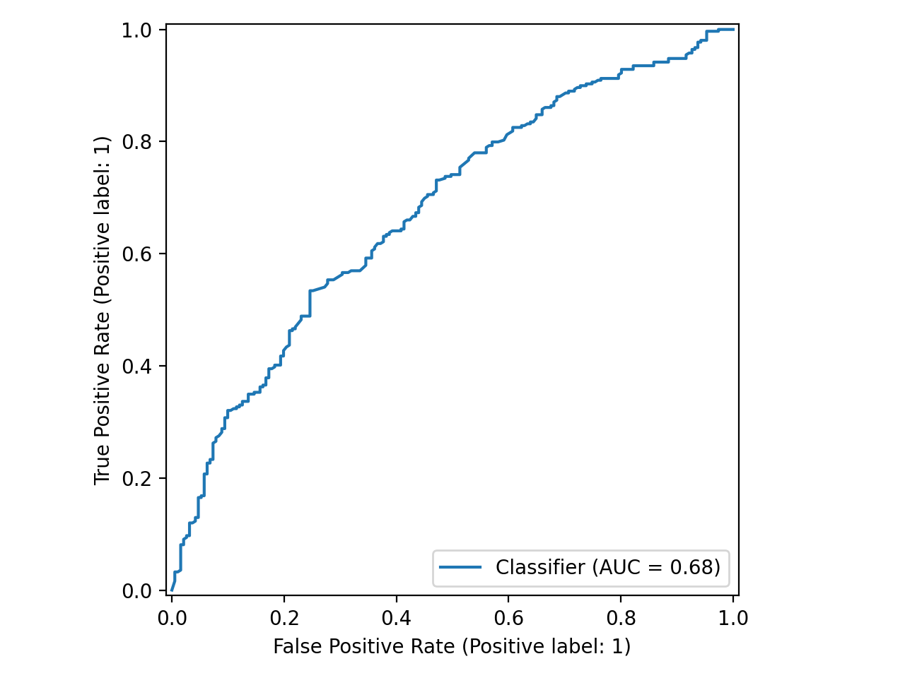
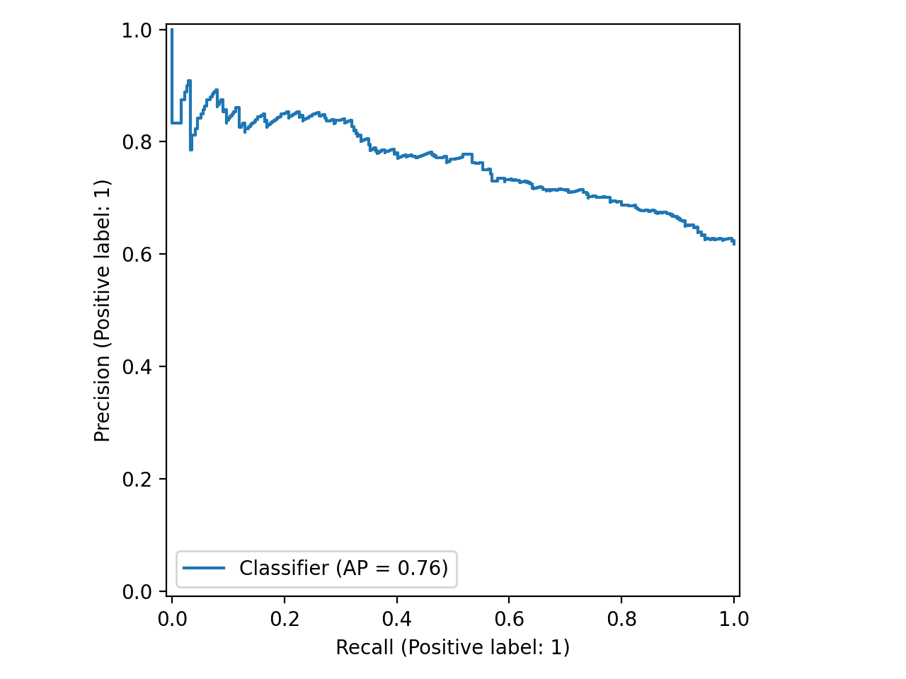
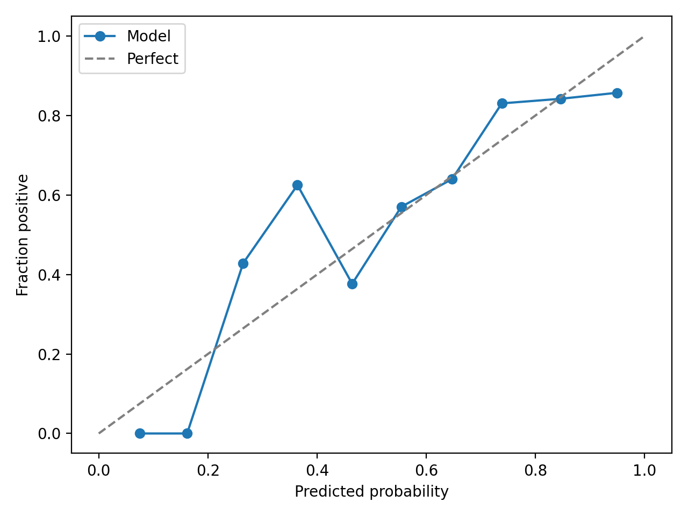
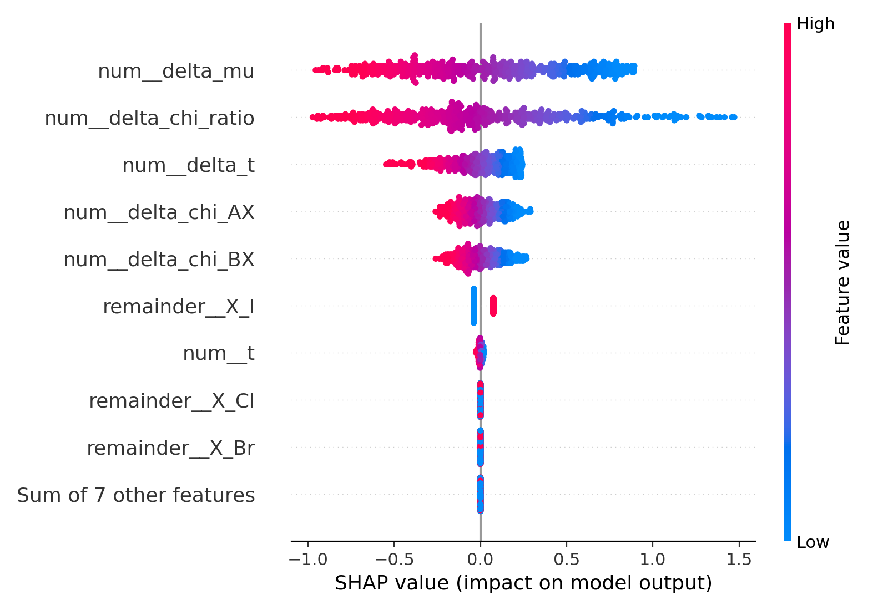

# Perovskite Stability ML

[](https://github.com/shawvidhi/perovskite-stability-ml/actions/workflows/ci.yml)

Predicting ABX₃ perovskite stability from physics-aware descriptors. I connect Goldschmidt tolerance factor, octahedral factor, and electronegativity gaps with calibrated ML (RF/LR) and SHAP to explain what drives stability. The pipeline is tested, reproducible, and CI-backed—showcasing how materials science fundamentals and data science can accelerate materials screening. This approach generalizes to semiconductor materials selection.

## Highlights
- Materials down-selection: calibrated probabilities support thresholding for screening.
- Explainability for R&D: SHAP reveals drivers for design iteration.
- Reproducible pipeline: tests, CI, and deterministic seeds.

## What & Why (Intel relevance)
- Physics-grounded features (t, μ, Δχ) reduce spurious correlations and support principled generalization.
- Calibrated probabilities enable risk-aware down-selection for semiconductor R&D.
- SHAP explainability clarifies drivers of stability for design iteration.
- The pipeline mirrors production standards: tests, pre-commit, CI, deterministic seeds.

## Data
- Synthetic ABX₃ (A∈{K,Rb,Cs}, B∈{Ge,Sn,Pb}, X∈{Cl,Br,I}). Ranges respect coordination chemistry for radii and Pauling electronegativity.
- Labels are stochastic via a smoothed rule around known stability windows with electronegativity moderation to avoid leakage and enforce class overlap.
- Script `scripts/make_synthetic_dataset.py` reproduces `data/synthetic/abx3_synthetic.csv`.

## Descriptors
- Goldschmidt tolerance factor: `t = (r_A + r_X) / (√2 (r_B + r_X))`.
- Octahedral factor: `μ = r_B / r_X`.
- Electronegativity gaps: `Δχ_AX`, `Δχ_BX`, `Δχ_ratio`.
- Derived margins: `δt=|t-0.9|`, `δμ=|μ-0.57|`.
- One-hot encodings for A, B, X.

## Modeling
- Logistic Regression (scaled) and Random Forest with cross-validation and probability calibration (Platt/Isotonic).
- Primary scoring: ROC-AUC; also F1, PR-AUC. Deterministic seeds.

## Results (typical on synthetic data)

Metrics (test set):

| Metric    | Value |
|-----------|-------|
| ROC-AUC   | 0.677 |
| PR-AUC    | 0.762 |
| F1        | 0.764 |
| Brier     | 0.216 |

Figures:









## Explainability
- Global SHAP summary (bar + beeswarm) and local waterfalls for representative stable/unstable/borderline compounds saved under `reports/figures/`.

## Limitations
- Synthetic data only; not a substitute for DFT/experiment. Calibrated outputs and SHAP are illustrative.

## Quickstart
```bash
# 0) Install package and dev tools
pip install -e .[dev]

# One-command run (data → train → eval → SHAP)
./scripts/run_all.sh

# 1) Create synthetic data
python scripts/make_synthetic_dataset.py --n 2500 --seed 42

# 2) Train models from config
python -m perostab.train --config configs/model/random_forest.yaml
python -m perostab.train --config configs/model/logreg.yaml

# 3) Evaluate the saved best model on test set
python -m perostab.evaluate --model-path models/rf.joblib

# 4) Generate SHAP explanations for saved model (use LR for stable SHAP)
python -m perostab.explain --model-path models/logreg.joblib --n-samples 500
```

## Pipeline Diagram
```
flowchart LR
    A[make_synthetic_dataset.py] --> B[Feature build (t, μ, Δχ, one-hot)]
    B --> C[CV + Calibration (RF/LR)]
    C --> D[Evaluate (ROC/PR/F1/Calibration)]
    C --> E[Explain (SHAP)]
    D --> F[Reports: figures & tables]
    E --> F
```

## Repository Layout
See tree in the issue description; key dirs: `src/perostab/`, `configs/`, `scripts/`, `reports/`, `tests/`.

## Model Card
See `model_card.md` for intended use, data, metrics, explainability, limitations, and next steps.

## Resume/LinkedIn bullets
- Connected materials physics with ML by encoding Goldschmidt t, octahedral μ, and electronegativity gaps to predict ABX₃ stability with calibrated probabilities.
- Built a tested, CI-backed pipeline (unit tests, pre-commit, GitHub Actions), producing explainable SHAP insights for materials down-selection.
- Delivered robust slice analysis (by halide and B-cation) and uncertainty estimates, emulating production-grade screening for semiconductor R&D.

## Development
- Python 3.11. Install: `pip install -e .[dev]`.
- Pre-commit: `pre-commit install` then `pre-commit run --all-files`.
- Tests: `pytest -q`.

## License
MIT License (see `LICENSE`).
